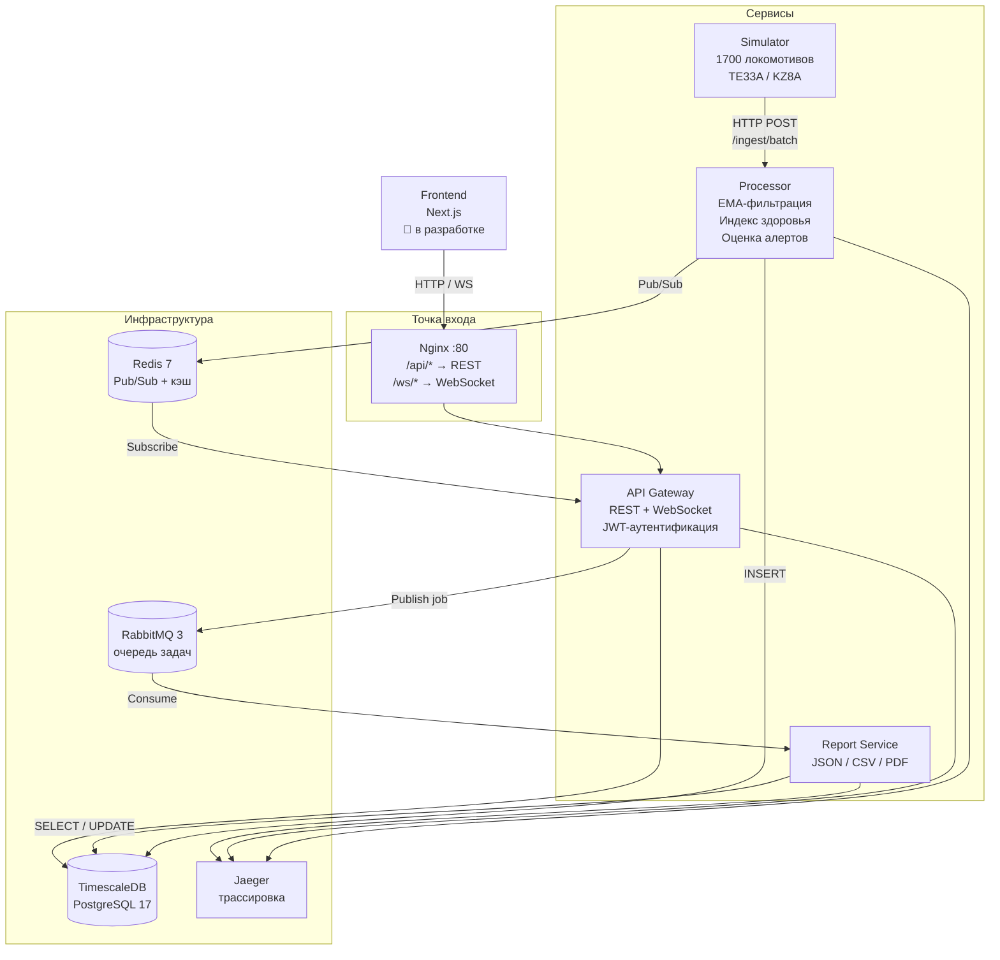

# Цифровой двойник локомотива

Полнофункциональный прототип дашборда «цифрового двойника» локомотива с расчётом индекса здоровья и потоковой телеметрией в реальном времени.

## Архитектура



### Сервисы

| Сервис | Порт | Описание |
|--------|------|----------|
| **Processor** | 8001 | Приём телеметрии, EMA-фильтрация, расчёт индекса здоровья, оценка алертов |
| **API Gateway** | 8000 | REST API + WebSocket, JWT-аутентификация, маршрутизация |
| **Report Service** | — | Фоновый воркер: генерация отчётов (JSON/CSV/PDF) через RabbitMQ |
| **Simulator** | 8003 | Генерация реалистичной телеметрии для TE33A и KZ8A |
| **Nginx** | 80 | Обратный прокси: `/api/*` → REST, `/ws/*` → WebSocket |

### Инфраструктура

| Компонент | Назначение |
|-----------|------------|
| **TimescaleDB** (PostgreSQL 17) | Хранение телеметрии, снимков здоровья, алертов (hypertables) |
| **Redis 7** | Pub/Sub для real-time каналов, кэш индекса здоровья |
| **RabbitMQ 3** | Очередь задач генерации отчётов |
| **Jaeger** | Распределённая трассировка (OpenTelemetry / OTLP) |

## Индекс здоровья

Нелинейная взвешенная формула:

```
HI(t) = 100 - Σ Wᵢ · ( max(0, |P̂ᵢ - Pnom| - δsafe) / Rᵢ )^k
```

Где:
- **P̂ᵢ** — EMA-сглаженное значение датчика
- **Pnom** — номинальное значение
- **δsafe** — полуширина безопасной зоны (без штрафа внутри)
- **Rᵢ** — критический диапазон (нормализация)
- **k** — показатель степени (обычно 2, резче у критических границ)
- **Wᵢ** — вес датчика (0–40; ≥35 = фатальные параметры)

### Категории

| Диапазон | Категория | Цвет |
|----------|-----------|------|
| ≥ 80 | Норма | Зелёный |
| 50–79 | Внимание | Жёлтый |
| < 50 | Критично | Красный |

### Дополнительно

- **Аккумулятор старения Монтсингера** — для термальных параметров (трансформатор, IGBT): скорость старения удваивается каждые 6°C выше референса
- **Top-5 факторов** — объяснимость: показываются датчики с максимальным вкладом в штраф
- **AESS-маскирование** — для TE33A при RPM ≤ 50 (режим сна двигателя) датчики RPM и давления масла не штрафуются

## Типы локомотивов

| Тип | Тяга | Датчики |
|-----|------|---------|
| **TE33A** | Дизель-электрическая (GE GEVO12) | diesel_rpm, oil_pressure, coolant_temp, fuel_level, fuel_rate, traction_motor_temp, crankcase_pressure |
| **KZ8A** | Электрическая (Alstom Prima II) | catenary_voltage, pantograph_current, transformer_temp, igbt_temp, recuperation_current, dc_link_voltage |
| Общие | — | speed_actual, speed_target, brake_pipe_pressure, wheel_slip_ratio |

## Быстрый старт

### Требования

- Docker и Docker Compose
- Make

### Запуск

```bash
# Поднять всё (инфра + сервисы + симулятор)
make up

# Только инфраструктура (БД, Redis, RabbitMQ, Jaeger)
make up-infra

# Сервисы без симулятора
make up-services

# Симулятор отдельно
make up-simulator
```

При первом запуске `.env` создаётся автоматически из `.env.example`.

### Управление

```bash
make logs            # Логи всех сервисов
make logs-api        # Логи API Gateway
make logs-processor  # Логи Processor
make logs-reports    # Логи Report Service
make logs-simulator  # Логи Simulator
make ps              # Статус контейнеров
make status          # Проверка health-эндпоинтов
make restart         # Перезапуск
make down            # Остановка
make clean           # Остановка + удаление данных и образов
```

### Тесты

```bash
make test                # Все тесты
make test-processor      # Тесты Processor
make test-api-gateway    # Тесты API Gateway
make test-report-service # Тесты Report Service
```

## API

После запуска Swagger UI доступен по адресу: **http://localhost/api/docs**

### Аутентификация

```bash
# Получить JWT-токен
curl -X POST http://localhost/api/auth/login \
  -H "Content-Type: application/json" \
  -d '{"username": "admin", "password": "admin"}'
```

Токен передаётся в заголовке: `Authorization: Bearer <token>`

### Основные эндпоинты

| Метод | Путь | Описание |
|-------|------|----------|
| `POST` | `/api/auth/login` | Авторизация → JWT |
| `GET` | `/api/locomotives` | Список локомотивов |
| `GET` | `/api/telemetry/{loco_id}` | Последние показания |
| `GET` | `/api/telemetry` | Исторические данные (фильтр по дате) |
| `GET` | `/api/health-index/{loco_id}` | Текущий индекс здоровья |
| `GET` | `/api/alerts` | Список алертов |
| `POST` | `/api/alerts/{id}/acknowledge` | Подтвердить алерт |
| `POST` | `/api/reports/generate` | Создать задачу отчёта |
| `GET` | `/api/reports/{id}` | Статус отчёта (поллинг) |
| `GET` | `/api/reports/{id}/download` | Скачать готовый отчёт |
| `GET/PUT` | `/api/config/health` | Пороги и веса (только админ) |
| `GET` | `/api/health` | Liveness probe |
| `GET` | `/api/ready` | Readiness probe (БД + Redis) |

### WebSocket

```
ws://localhost/ws/telemetry/{loco_id}  — поток телеметрии конкретного локомотива
ws://localhost/ws/alerts               — глобальный поток алертов
ws://localhost/ws/live/{loco_id}       — комбинированный: телеметрия + алерты + здоровье
```

Формат сообщений: `{"type": "telemetry"|"alert"|"health", "data": {...}}`
Протокол: JSON (по умолчанию) или msgpack (`WIRE_FORMAT=msgpack`).

### Генерация отчётов

```bash
# 1. Создать задачу
curl -X POST http://localhost/api/reports/generate \
  -H "Authorization: Bearer <token>" \
  -H "Content-Type: application/json" \
  -d '{"locomotive_id": "...", "report_type": "full", "format": "pdf",
       "date_range": {"start": "2026-04-04T00:00:00Z", "end": "2026-04-04T12:00:00Z"}}'

# 2. Поллинг статуса (pending → processing → completed)
curl http://localhost/api/reports/{report_id} -H "Authorization: Bearer <token>"

# 3. Скачать готовый файл
curl -O http://localhost/api/reports/{report_id}/download -H "Authorization: Bearer <token>"
```

Форматы: **JSON**, **CSV**, **PDF** (с поддержкой кириллицы через DejaVu Sans).

## Сценарии симулятора

| Сценарий | Описание |
|----------|----------|
| `normal` | Штатная работа флота |
| `highload` | Пиковая нагрузка (x10 событий) — стресс-тест |
| `degradation` | Постепенная деградация узлов |
| `emergency` | Аварийные ситуации |

Переключение через переменную окружения: `SIMULATOR_SCENARIO=highload`

## Мониторинг

Вся обсервабельность доступна из **одного интерфейса** — Grafana:

| Сервис | URL | Назначение |
|--------|-----|------------|
| **Grafana** | http://localhost:3001 (admin / admin) | Единое окно: метрики, логи, трассировки |
| Prometheus | http://localhost:9090 | PromQL-запросы (метрики) |
| Jaeger UI | http://localhost:16686 | Распределённые трассировки (OpenTelemetry) |
| Loki | внутренний | Агрегация структурированных JSON-логов |
| RabbitMQ Management | http://localhost:15672 (locomotive / changeme) | Очереди и потоки сообщений |
| Swagger UI | http://localhost/api/docs | Интерактивная документация API |

### Стек обсервабельности

```
Сервисы ──→ Prometheus (/metrics)  ──→ Grafana (метрики)
        ──→ Jaeger (OTLP :4317)    ──→ Grafana (трассировки)
        ──→ Promtail (Docker logs)  ──→ Loki ──→ Grafana (логи)
```

- **Метрики:** Prometheus скрейпит `/metrics` каждые 5 сек → предустановленный дашборд в Grafana
- **Трассировки:** OpenTelemetry → Jaeger → Grafana (исключены `/metrics`, `/health`, `/ready`)
- **Логи:** structlog JSON → Docker → Promtail → Loki → Grafana (с фильтрацией по service, level, trace_id)
- **Связь логов и трассировок:** клик по `trace_id` в логах Loki открывает трассировку в Jaeger

### Метрики (Prometheus)

Каждый сервис экспортирует `/metrics` в формате Prometheus:

| Метрика | Тип | Описание |
|---------|-----|----------|
| `http_requests_total` | Counter | Общее количество HTTP-запросов (service, method, path, status) |
| `http_request_duration_seconds` | Histogram | Латентность запросов (p50, p95, p99) |
| `http_requests_in_progress` | Gauge | Количество запросов в обработке |
| `telemetry_ingested_total` | Counter | Количество принятых сенсорных показаний |
| `health_index_calculated_total` | Counter | Количество расчётов индекса здоровья |
| `health_index_value` | Gauge | Текущий индекс здоровья по локомотивам |
| `alerts_fired_total` | Counter | Количество сработавших алертов (severity, sensor_type) |
| `ws_connections_active` | Gauge | Активные WebSocket-подключения |
| `reports_generated_total` | Counter | Сгенерированные отчёты (format, status) |

## Стек технологий

**Backend:** Python 3.13, FastAPI, SQLAlchemy 2.0 (async), Alembic, aio-pika, redis.asyncio

**Инфра:** Docker Compose, Nginx, TimescaleDB, Redis 7, RabbitMQ 3

**Обсервабельность:** Prometheus + Grafana (метрики), Jaeger + OpenTelemetry (трассировки), structlog (логи)

**Безопасность:** JWT (HS256), bcrypt, CORS, role-based access

**Инструменты:** uv (пакетный менеджер), Ruff (линтер/форматтер)

## Конфигурация

Все настройки — через переменные окружения (`.env`). Основные:

| Переменная | Описание | По умолчанию |
|------------|----------|--------------|
| `WIRE_FORMAT` | Формат сообщений WS (json/msgpack) | `json` |
| `SIMULATOR_FLEET_SIZE` | Количество локомотивов | `1700` |
| `SIMULATOR_SCENARIO` | Сценарий симуляции | `normal` |
| `GATEWAY_JWT_SECRET` | Секрет подписи JWT | — |
| `GATEWAY_JWT_EXPIRY_MINUTES` | Время жизни токена | `60` |
| `OTEL_ENABLED` | Включить трассировку | `true` |
| `LOG_FORMAT` | Формат логов (json/text) | `json` |

Полный список — в `.env.example`.

## Frontend (в разработке)

> **Статус:** каркас проекта создан, UI ещё не реализован.

**Стек:** Next.js 16, React 19, Mantine UI 9, Recharts, Redux Toolkit, TypeScript

**Запланировано:**

- [ ] Экран «Кабина» с виджетом индекса здоровья и цветовой индикацией
- [ ] Панели: Скорость, Топливо/Энергия, Давления/Температуры, Электрика, Алерты, Тренды
- [ ] Интерактивные графики с авто-скейлингом, tooltips, zoom
- [ ] Карта/схема участка пути с текущим положением
- [ ] Перемотка (replay) последних 5–15 минут
- [ ] Скачивание отчётов (PDF/CSV)
- [ ] Тёмная/светлая тема
- [ ] Адаптивность (24″ панель + ноутбук)

```bash
cd frontend/dashboard
pnpm install
pnpm dev  # http://localhost:3000
```

## Структура проекта

```
├── docker-compose.yml
├── Makefile
├── pyproject.toml                     # uv workspace, Ruff конфиг, dev-зависимости
├── uv.lock
├── .env.example
│
├── deploy/
│   ├── nginx.conf                     # Обратный прокси (/api/*, /ws/*)
│   ├── prometheus.yml                 # Конфигурация скрейпинга Prometheus
│   └── grafana/
│       ├── provisioning/
│       │   ├── datasources/
│       │   │   └── prometheus.yml     # Авто-подключение Prometheus к Grafana
│       │   └── dashboards/
│       │       └── dashboards.yml     # Провизионинг дашбордов
│       └── dashboards/
│           └── locomotive-digital-twin.json  # Предустановленный дашборд
│
├── shared/                            # Общая библиотека (все сервисы зависят)
│   └── shared/
│       ├── constants.py               # SensorSpec, EMA gains, пороги HI
│       ├── enums.py                   # LocomotiveType, SensorType, AlertSeverity
│       ├── schemas/                   # Pydantic-модели (telemetry, alert, report, health)
│       ├── wire.py                    # Сериализация (JSON / msgpack)
│       └── observability/
│           ├── bootstrap.py           # Инициализация OTel + логов
│           ├── tracing.py             # OTLP-трассировка → Jaeger
│           ├── metrics.py             # OTLP-метрики (опционально)
│           ├── prometheus.py          # Prometheus: middleware, /metrics, бизнес-метрики
│           ├── logging.py             # Structlog JSON-конфигурация
│           └── middleware.py          # Request context middleware
│
├── services/
│   ├── processor/                     # Приём и обработка телеметрии
│   │   ├── Dockerfile
│   │   └── processor/
│   │       ├── api/
│   │       │   ├── router_ingest.py   # POST /telemetry/ingest[/batch]
│   │       │   └── router_health.py   # GET /health, /ready
│   │       ├── core/                  # Config, DB (create_all + hypertables), Redis
│   │       ├── models/                # ORM: raw_telemetry, health_snapshots, alert_events
│   │       ├── services/
│   │       │   ├── ingestion_service.py   # EMA-фильтр, flatten, HF-дедупликация
│   │       │   ├── filter_service.py      # Экспоненциальное сглаживание
│   │       │   ├── health_service.py      # Расчёт индекса здоровья (real-time)
│   │       │   └── alert_evaluator.py     # Контекстная оценка алертов (AESS, cross-valid)
│   │       └── tests/
│   │
│   ├── api-gateway/                   # REST API + WebSocket + аутентификация
│   │   ├── Dockerfile
│   │   └── api_gateway/
│   │       ├── api/
│   │       │   ├── router_auth.py         # POST /auth/login → JWT
│   │       │   ├── router_telemetry.py    # GET /telemetry, /telemetry/{id}
│   │       │   ├── router_alerts.py       # GET /alerts, POST /alerts/{id}/acknowledge
│   │       │   ├── router_reports.py      # POST /reports/generate, GET /reports/{id}[/download]
│   │       │   ├── router_locomotives.py  # CRUD /locomotives
│   │       │   ├── router_config.py       # GET/PUT /config/health (admin)
│   │       │   ├── router_health.py       # GET /health, /ready
│   │       │   └── ws_telemetry.py        # WS /ws/telemetry/{id}, /ws/alerts, /ws/live/{id}
│   │       ├── core/                  # Auth (JWT), DB, Redis, RabbitMQ, CORS, middleware
│   │       ├── models/                # ORM: users, locomotives, alerts, reports, health_thresholds
│   │       ├── services/
│   │       │   ├── connection_manager.py  # WebSocket fan-out, Redis pub/sub, backpressure
│   │       │   ├── health_service.py      # Кэш индекса здоровья в Redis
│   │       │   ├── alert_service.py       # Персистенция алертов из Redis → DB
│   │       │   └── report_request_service.py  # Создание задач отчётов → RabbitMQ
│   │       └── tests/
│   │
│   ├── report-service/                # Генерация отчётов (фоновый воркер RabbitMQ)
│   │   ├── Dockerfile
│   │   └── report_service/
│   │       ├── api/                   # Роуты: reports, analytics, health-index
│   │       ├── core/                  # Config, DB, RabbitMQ consumer
│   │       ├── models/                # ORM: generated_reports
│   │       ├── services/
│   │       │   ├── report_worker.py       # Обработчик задач из очереди
│   │       │   ├── report_generator.py    # Агрегация данных (sensor stats, health trends)
│   │       │   ├── report_formatter.py    # Форматирование: JSON / CSV / PDF
│   │       │   ├── health_index_calculator.py  # Batch-расчёт HI для отчётов
│   │       │   ├── anomaly_detector.py    # Z-score детекция аномалий
│   │       │   └── fleet_analytics_service.py  # Аналитика по флоту
│   │       └── tests/
│   │
│   └── simulator/                     # Генератор реалистичной телеметрии
│       ├── Dockerfile
│       └── simulator/
│           ├── core/                  # Config, HTTP-клиент
│           ├── models/                # LocomotiveState, Fleet
│           ├── generators/
│           │   ├── te33a.py           # Дизель-электрический (GE GEVO12)
│           │   └── kz8a.py            # Электрический (Alstom Prima II)
│           └── scenarios/
│               ├── normal.py          # Штатная работа
│               ├── highload.py        # Стресс-тест (x10)
│               ├── degradation.py     # Постепенная деградация
│               └── emergency.py       # Аварийные ситуации
│
└── frontend/
    └── dashboard/                     # Next.js 16 приложение (в разработке)
        ├── package.json               # Mantine 9, Recharts, Redux Toolkit
        └── src/app/
```
