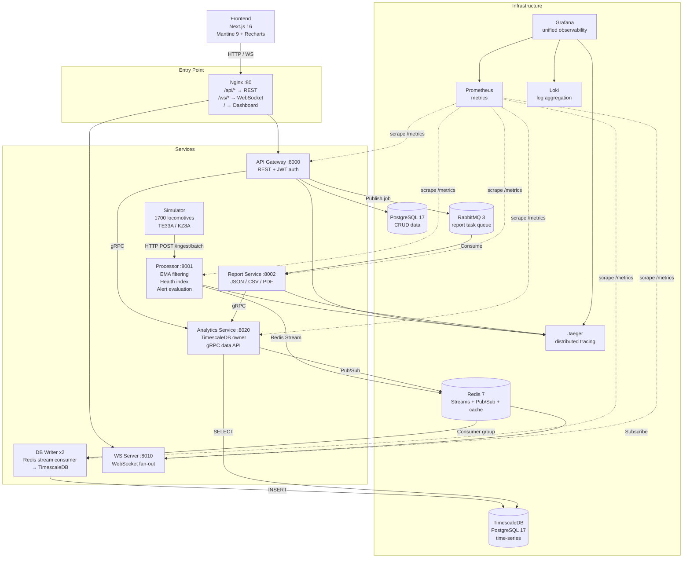

# Locomotive Digital Twin

A full-featured prototype of a locomotive "digital twin" dashboard with health index calculation and real-time streaming telemetry.

## Architecture



### Services

| Service | Port | Description |
|---------|------|-------------|
| **Processor** | 8001 | Telemetry ingestion, EMA filtering, health index calculation, alert evaluation. Publishes to Redis Streams. |
| **DB Writer** (×2) | — | Redis Stream consumer group; writes telemetry, health snapshots, and alerts to TimescaleDB. Two parallel instances for throughput. |
| **Analytics Service** | 8020 | Sole owner of the TimescaleDB schema (Alembic migrations). Reads time-series data and exposes it via gRPC to other services. |
| **API Gateway** | 8000 | REST API with JWT authentication, routing, and business logic. Calls Analytics Service over gRPC. |
| **WS Server** | 8010 | Dedicated WebSocket server; subscribes to Redis Pub/Sub and fans out real-time events to connected clients. |
| **Report Service** | 8002 | Background RabbitMQ worker: generates reports (JSON/CSV/PDF) using data from Analytics Service. |
| **Simulator** | 8003 | Generates realistic telemetry for TE33A and KZ8A locomotive fleets. |
| **Dashboard** | 3000 (internal) | Next.js 16 frontend — the digital twin dashboard. |
| **Nginx** | 80 | Reverse proxy: `/api/*` → API Gateway, `/ws/*` → WS Server, `/` → Dashboard. |

### Infrastructure

| Component | Purpose |
|-----------|---------|
| **PostgreSQL 17** | CRUD data: users, locomotives, report metadata, health thresholds. Two databases: `locomotive_app` (API Gateway) and `locomotive_reports` (Report Service). |
| **TimescaleDB** (PostgreSQL 17) | Time-series data: raw telemetry, health snapshots, alert events — stored in hypertables with compression and retention policies. |
| **Redis 7** | Redis Streams for durable telemetry delivery (consumer groups); Pub/Sub for real-time fan-out; health index cache. |
| **RabbitMQ 3** | Asynchronous report generation task queue. |
| **Jaeger** | Distributed tracing via OpenTelemetry / OTLP. |
| **Prometheus** | Metrics scraping from all services every 5 s. |
| **Loki + Promtail** | Structured JSON log aggregation from Docker containers. |
| **Grafana** | Unified observability UI: metrics, logs, and traces in one place. |

## Health Index

Non-linear weighted formula:

```
HI(t) = 100 - Σ Wᵢ · ( max(0, |P̂ᵢ - Pnom| - δsafe) / Rᵢ )^k
```

Where:
- **P̂ᵢ** — EMA-smoothed sensor value
- **Pnom** — nominal value
- **δsafe** — half-width of the safe zone (no penalty inside)
- **Rᵢ** — critical range (normalization)
- **k** — exponent (typically 2; steeper near critical boundaries)
- **Wᵢ** — sensor weight (0–40; ≥35 = fatal parameters)

### Categories

| Range | Category | Color |
|-------|----------|-------|
| ≥ 80 | Normal | Green |
| 50–79 | Warning | Yellow |
| < 50 | Critical | Red |

### Additional Features

- **Montsinger aging accumulator** — for thermal parameters (transformer, IGBT): aging rate doubles every 6 °C above the reference temperature
- **Top-5 contributing factors** — explainability: shows sensors with the highest penalty contribution
- **AESS masking** — for TE33A when RPM ≤ 50 (engine sleep mode), RPM and oil pressure sensors are excluded from penalty calculation

## Locomotive Types

| Type | Drive | Sensors |
|------|-------|---------|
| **TE33A** | Diesel-electric (GE GEVO12) | diesel_rpm, oil_pressure, coolant_temp, fuel_level, fuel_rate, traction_motor_temp, crankcase_pressure |
| **KZ8A** | Electric (Alstom Prima II) | catenary_voltage, pantograph_current, transformer_temp, igbt_temp, recuperation_current, dc_link_voltage |
| Common | — | speed_actual, speed_target, brake_pipe_pressure, wheel_slip_ratio |

## Quick Start

### Requirements

- Docker and Docker Compose
- Make

### Running

```bash
# Start everything (infra + services + simulator)
make up

# Infrastructure only (databases, Redis, RabbitMQ, Jaeger)
make up-infra

# Services without the simulator
make up-services

# Simulator only
make up-simulator
```

On first run, `.env` is automatically created from `.env.example`.

### Management

```bash
make logs            # Logs from all services
make logs-api        # API Gateway logs
make logs-processor  # Processor logs
make logs-reports    # Report Service logs
make logs-simulator  # Simulator logs
make ps              # Container status
make status          # Check health endpoints
make restart         # Restart all services
make down            # Stop all services
make clean           # Stop + remove volumes and images
```

### Tests

```bash
make test                # All tests
make test-processor      # Processor tests
make test-api-gateway    # API Gateway tests
make test-report-service # Report Service tests
```

## API

After startup, the Swagger UI is available at: **http://localhost/api/docs**

### Authentication

```bash
# Obtain a JWT token
curl -X POST http://localhost/api/auth/login \
  -H "Content-Type: application/json" \
  -d '{"username": "admin", "password": "admin"}'
```

Pass the token in the header: `Authorization: Bearer <token>`

### Main Endpoints

| Method | Path | Description |
|--------|------|-------------|
| `POST` | `/api/auth/login` | Authenticate → JWT |
| `GET` | `/api/locomotives` | List locomotives |
| `GET` | `/api/telemetry/{loco_id}` | Latest telemetry readings |
| `GET` | `/api/telemetry` | Historical data (date filter) |
| `GET` | `/api/health-index/{loco_id}` | Current health index |
| `GET` | `/api/alerts` | List alerts |
| `POST` | `/api/alerts/{id}/acknowledge` | Acknowledge an alert |
| `POST` | `/api/reports/generate` | Create a report generation task |
| `GET` | `/api/reports/{id}` | Report status (polling) |
| `GET` | `/api/reports/{id}/download` | Download a completed report |
| `GET/PUT` | `/api/config/health` | Health thresholds and weights (admin only) |
| `GET` | `/api/health` | Liveness probe |
| `GET` | `/api/ready` | Readiness probe (DB + Redis) |

### WebSocket

```
ws://localhost/ws/live/{loco_id}   — combined: telemetry + alerts + health
```

Message format: `{"type": "telemetry"|"alert"|"health", "data": {...}}`  
Wire protocol: msgpack (binary).

### Report Generation

```bash
# 1. Create a task
curl -X POST http://localhost/api/reports/generate \
  -H "Authorization: Bearer <token>" \
  -H "Content-Type: application/json" \
  -d '{"locomotive_id": "...", "report_type": "full", "format": "pdf",
       "date_range": {"start": "2026-04-04T00:00:00Z", "end": "2026-04-04T12:00:00Z"}}'

# 2. Poll status (pending → processing → completed)
curl http://localhost/api/reports/{report_id} -H "Authorization: Bearer <token>"

# 3. Download the completed file
curl -O http://localhost/api/reports/{report_id}/download -H "Authorization: Bearer <token>"
```

Formats: **JSON**, **CSV**, **PDF** (with Cyrillic support via DejaVu Sans).

## Simulator Scenarios

| Scenario | Description |
|----------|-------------|
| `normal` | Standard fleet operation |
| `highload` | Peak load (×10 events) — stress test |
| `degradation` | Gradual component degradation |
| `emergency` | Emergency situations |

Switch via environment variable: `SIMULATOR_SCENARIO=highload`

## Monitoring

All observability is available from a **single interface** — Grafana:

| Service | URL | Purpose |
|---------|-----|---------|
| **Grafana** | http://localhost:3001 (admin / admin) | Unified view: metrics, logs, traces |
| Prometheus | http://localhost:9090 | PromQL queries (metrics) |
| Jaeger UI | http://localhost:16686 | Distributed traces (OpenTelemetry) |
| Loki | internal | Structured JSON log aggregation |
| RabbitMQ Management | http://localhost:15672 (locomotive / changeme) | Queues and message flows |
| Swagger UI | http://localhost/api/docs | Interactive API documentation |

### Observability Stack

```
Services ──→ Prometheus (/metrics)  ──→ Grafana (metrics)
         ──→ Jaeger (OTLP :4317)    ──→ Grafana (traces)
         ──→ Promtail (Docker logs)  ──→ Loki ──→ Grafana (logs)
```

- **Metrics:** Prometheus scrapes `/metrics` every 5 s → pre-built Grafana dashboard
- **Traces:** OpenTelemetry → Jaeger → Grafana (excluding `/metrics`, `/health`, `/ready`)
- **Logs:** structlog JSON → Docker → Promtail → Loki → Grafana (filterable by service, level, trace_id)
- **Log-to-trace correlation:** clicking a `trace_id` in Loki logs opens the trace in Jaeger

### Prometheus Metrics

Each service exports `/metrics` in Prometheus format:

| Metric | Type | Description |
|--------|------|-------------|
| `http_requests_total` | Counter | Total HTTP requests (service, method, path, status) |
| `http_request_duration_seconds` | Histogram | Request latency (p50, p95, p99) |
| `http_requests_in_progress` | Gauge | Requests currently being processed |
| `telemetry_ingested_total` | Counter | Total sensor readings ingested |
| `health_index_calculated_total` | Counter | Total health index calculations |
| `health_index_value` | Gauge | Current health index per locomotive |
| `alerts_fired_total` | Counter | Total alerts fired (severity, sensor_type) |
| `ws_connections_active` | Gauge | Active WebSocket connections |
| `reports_generated_total` | Counter | Reports generated (format, status) |

## Technology Stack

**Frontend:** Next.js 16, React 19, TypeScript, Mantine UI 9, Recharts, Leaflet, Redux Toolkit

**Backend:** Python 3.13, FastAPI, SQLAlchemy 2.0 (async), Alembic, aio-pika, redis.asyncio, grpcio

**Infrastructure:** Docker Compose, Nginx, PostgreSQL 17, TimescaleDB, Redis 7, RabbitMQ 3

**Observability:** Prometheus + Grafana (metrics), Jaeger + OpenTelemetry (sampled traces), structlog + Loki + Promtail (logs)

**Security:** JWT (HS256), bcrypt, CORS, role-based access

**Tooling:** uv (package manager), Ruff (linter/formatter), Biome (frontend)

## Configuration

All settings are configured via environment variables (`.env`). Key variables:

| Variable | Description | Default |
|----------|-------------|---------|
| `WIRE_FORMAT` | WebSocket message format | `msgpack` |
| `SIMULATOR_FLEET_SIZE` | Number of locomotives | `1700` |
| `SIMULATOR_SCENARIO` | Simulation scenario | `normal` |
| `GATEWAY_JWT_SECRET` | JWT signing secret | — |
| `GATEWAY_JWT_EXPIRY_MINUTES` | Token lifetime | `60` |
| `OTEL_ENABLED` | Enable tracing | `true` |
| `OTEL_TRACE_SAMPLE_RATE` | Fraction of traces sampled (0.0–1.0) | `0.05` |
| `LOG_FORMAT` | Log format (json/text) | `json` |

Full list available in `.env.example`.

## Frontend

**Stack:** Next.js 16, React 19, Mantine UI 9, Recharts, Redux Toolkit, Leaflet, TypeScript

**Features:**

- "Cockpit" dashboard with health index widget and color-coded status
- Telemetry panels: speed, fuel/energy, pressures/temperatures, electrics, alerts, trends
- Interactive charts (Recharts) with auto-scaling
- Route map (Leaflet) showing current locomotive position
- Real-time updates via WebSocket (msgpack)
- Report generation and download (PDF/CSV/JSON)
- Pages: Dashboard, Reports, Config (thresholds/weights), Users, Login
- Dark/light theme (Mantine)
- Responsive layout (24″ panel + laptop)

### Local Development (without Docker)

```bash
cd frontend/dashboard
pnpm install
pnpm dev  # http://localhost:3000
```

### In Docker (via docker-compose)

The frontend is automatically built and served as part of `make up`, accessible through Nginx on port 80.

## Project Structure

```
├── docker-compose.yml
├── Makefile
├── pyproject.toml                     # uv workspace, Ruff config, dev dependencies
├── uv.lock
├── .env.example
│
├── deploy/
│   ├── nginx.conf                     # Reverse proxy (/api/*, /ws/*)
│   ├── prometheus.yml                 # Prometheus scrape configuration
│   ├── promtail.yml                   # Promtail log shipper configuration
│   └── grafana/
│       ├── provisioning/
│       │   ├── datasources/           # Auto-provisioned data sources
│       │   └── dashboards/            # Dashboard provisioning config
│       └── dashboards/
│           └── locomotive-digital-twin.json  # Pre-built Grafana dashboard
│
├── shared/                            # Shared library (all services depend on it)
│   └── shared/
│       ├── constants.py               # SensorSpec, EMA gains, HI thresholds
│       ├── enums.py                   # LocomotiveType, SensorType, AlertSeverity
│       ├── schemas/                   # Pydantic models (telemetry, alert, report, health)
│       ├── wire.py                    # Serialization (JSON / msgpack)
│       └── observability/
│           ├── bootstrap.py           # OTel + logging initialization
│           ├── tracing.py             # OTLP tracing → Jaeger
│           ├── metrics.py             # OTLP metrics (optional)
│           ├── prometheus.py          # Prometheus: middleware, /metrics, business metrics
│           ├── logging.py             # structlog JSON configuration
│           └── middleware.py          # Request context middleware
│
├── services/
│   ├── processor/                     # Telemetry ingestion and processing
│   │   ├── Dockerfile
│   │   └── processor/
│   │       ├── api/
│   │       │   ├── router_ingest.py   # POST /telemetry/ingest[/batch]
│   │       │   └── router_health.py   # GET /health, /ready
│   │       ├── core/                  # Config, Redis Streams publisher
│   │       └── services/
│   │           ├── ingestion_service.py   # EMA filter, flatten, HF deduplication
│   │           ├── filter_service.py      # Exponential smoothing
│   │           ├── health_service.py      # Real-time health index calculation
│   │           └── alert_evaluator.py     # Contextual alert evaluation (AESS, cross-validation)
│   │
│   ├── db-writer/                     # Redis Stream → TimescaleDB writer
│   │   ├── Dockerfile
│   │   └── db_writer/                 # Consumer group worker (two instances: writer-1, writer-2)
│   │
│   ├── analytics-service/             # TimescaleDB owner + gRPC data API
│   │   ├── Dockerfile
│   │   ├── alembic/                   # Database migrations
│   │   └── analytics/
│   │       ├── api/                   # gRPC service definitions and handlers
│   │       ├── core/                  # Config, DB, Redis
│   │       └── models/                # ORM: raw_telemetry, health_snapshots, alert_events
│   │
│   ├── api-gateway/                   # REST API + JWT authentication
│   │   ├── Dockerfile
│   │   └── api_gateway/
│   │       ├── api/
│   │       │   ├── router_auth.py         # POST /auth/login → JWT
│   │       │   ├── router_telemetry.py    # GET /telemetry, /telemetry/{id}
│   │       │   ├── router_alerts.py       # GET /alerts, POST /alerts/{id}/acknowledge
│   │       │   ├── router_reports.py      # POST /reports/generate, GET /reports/{id}[/download]
│   │       │   ├── router_locomotives.py  # CRUD /locomotives
│   │       │   ├── router_config.py       # GET/PUT /config/health (admin)
│   │       │   └── router_health.py       # GET /health, /ready
│   │       ├── core/                  # Auth (JWT), DB, Redis, RabbitMQ, CORS, middleware
│   │       ├── models/                # ORM: users, locomotives, alerts, reports, health_thresholds
│   │       └── services/
│   │           ├── health_service.py      # Health index cache in Redis
│   │           ├── alert_service.py       # Alert persistence from Redis → DB
│   │           └── report_request_service.py  # Create report tasks → RabbitMQ
│   │
│   ├── ws-server/                     # Dedicated WebSocket server
│   │   ├── Dockerfile
│   │   └── ws_server/                 # Redis Pub/Sub subscriber + WebSocket fan-out
│   │
│   ├── report-service/                # Report generation (RabbitMQ background worker)
│   │   ├── Dockerfile
│   │   └── report_service/
│   │       ├── api/                   # Routes: reports, analytics, health-index
│   │       ├── core/                  # Config, DB, RabbitMQ consumer
│   │       ├── models/                # ORM: generated_reports
│   │       └── services/
│   │           ├── report_worker.py       # Task queue handler
│   │           ├── report_generator.py    # Data aggregation (sensor stats, health trends)
│   │           ├── report_formatter.py    # Formatting: JSON / CSV / PDF
│   │           ├── health_index_calculator.py  # Batch HI calculation for reports
│   │           ├── anomaly_detector.py    # Z-score anomaly detection
│   │           └── fleet_analytics_service.py  # Fleet-wide analytics
│   │
│   └── simulator/                     # Realistic telemetry generator
│       ├── Dockerfile
│       └── simulator/
│           ├── core/                  # Config, HTTP client
│           ├── models/                # LocomotiveState, Fleet
│           ├── generators/
│           │   ├── te33a.py           # Diesel-electric (GE GEVO12)
│           │   └── kz8a.py            # Electric (Alstom Prima II)
│           └── scenarios/
│               ├── normal.py          # Standard operation
│               ├── highload.py        # Stress test (×10)
│               ├── degradation.py     # Gradual degradation
│               └── emergency.py       # Emergency situations
│
└── frontend/
    └── dashboard/                     # Next.js 16 application
        ├── package.json               # Mantine 9, Recharts, Redux Toolkit, Leaflet
        ├── next.config.ts             # Standalone output, wire format config
        └── src/
            ├── app/                   # Next.js App Router (dashboard, reports, config, users, login)
            ├── features/telemetry/    # Telemetry hooks, types, API
            └── shared/                # API client, WebSocket, utilities, types
```
